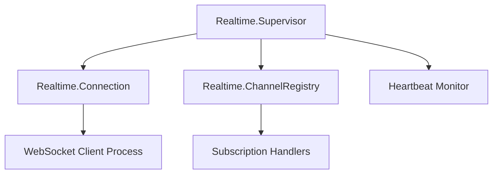

# RFC: Realtime-Ex for Supabase SDK in Elixir

Authors: [@zoedsoupe](https://github.com/zoedsoupe)
Status: Draft / First Release Proposal

## 1. Overview

The realtime-ex library aims to provide a robust, extensible real-time client for Supabase in Elixir. It is designed to mirror the behavior of realtime-js and Phoenix Channels while integrating seamlessly with supabase_potion for Supabase client management and HTTP abstractions. Key features include:
-	Reliable connection management using OTP supervision.
-	Channel-based subscription system for filtering events.
-	Automatic reconnection and heartbeat mechanisms.
-	Extensible API for custom event handling and advanced use cases.

## 2. Goals and Design Principles

### Goals
-	Reliability & Fault Tolerance: Leverage OTP patterns (e.g., supervisors, GenServers) to manage connections and ensure resiliency.
-	Extensibility: Provide hooks and behaviors for custom event parsing, logging, and metrics.
-	Consistency: Align the API with existing Supabase SDK conventions and realtime-js paradigms.
-	Integration: Seamlessly plug into supabase_potion, utilizing its builder pattern and client management strategies.

### Design Principles
-	Modular Architecture: Separate concerns into connection management, channel subscriptions, message routing, and integration layers.
-	OTP-Centric: Use supervisors and GenServers to manage processes, ensuring automatic recovery from failures.
-	Transparent API: Expose a straightforward API for developers, hiding internal complexity while allowing advanced configurations.
-	Testability: Structure modules to be easily unit-tested and integrated into CI pipelines.

## 3. Expected Behavior

### Final Version Behaviors
-	Connection Lifecycle:
-	Initiate a WebSocket connection to the realtime endpoint.
-	Maintain an internal heartbeat to detect dropped connections.
-	Automatically reconnect upon failure with exponential backoff.
-	Channel Subscription & Event Handling:
-	Allow users to subscribe to topics (e.g., "public:table") with event filters (e.g., "INSERT", "UPDATE").
-	Dispatch received events to registered callback functions.
-	Provide a flexible mechanism for handling custom event types.
-	Error Handling:
-	Bubble up connection and message parsing errors with clear logging.
-	Support user-defined error callbacks.
-	Extensibility:
-	Allow plugging in custom serializers/deserializers.
-	Expose hooks for logging and metrics.

### User API Example

A simple example of the intended user API might look like this:

```elixir
defmodule MyApp.RealtimeClient do
  alias Supabase.Realtime

  def start_link(opts \\ []) do
		# we can construct the URL internally on supabsae_potion
    Realtime.start_link("wss://realtime.supabase.co", opts)
  end
end
```

This design mimics the simplicity of realtime-js while leveraging Elixir’s concurrency strengths.

## 4. Internal Architecture

### Process Structure

The implementation should follow an OTP supervision tree. At a high level:
-	Realtime.Supervisor: Top-level supervisor that starts:
-	Connection Manager (Realtime.Connection): Manages WebSocket connection lifecycle.
-	Channel Manager (Realtime.ChannelRegistry): Maintains a registry of subscriptions and routes incoming events.
-	Heartbeat Monitor: Periodically sends heartbeat messages and checks for connection liveness.

A Mermaid diagram illustrates this supervision tree:



### Message Flow
1.	Connection Establishment:
The Connection Manager starts a WebSocket connection using a client (e.g., leveraging an existing library like :gun or a native WebSocket client). Upon connection, a handshake is performed similar to Phoenix Channels.
1.	Subscription Registration:
Users register subscriptions via the public API. These are stored in the Channel Registry, which maps topics and event types to callback functions.
1.	Incoming Message Dispatch:
When a message is received:
	-	The Connection Manager passes it to the Channel Registry.
	-	The registry decodes the payload and identifies the topic and event.
	-	Registered callbacks for the specific topic and event are invoked.
1.	Reconnection & Heartbeat:
A dedicated monitor ensures that if the heartbeat fails or the connection drops, the Connection Manager will attempt a reconnect with a configurable backoff strategy.

## 5. Integration with supabase_potion

Since supabase_potion already provides the base client and HTTP abstractions via the builder pattern, realtime-ex should:
-	Expose a configuration interface that can be merged into the supabase_potion configuration.
-	Share common logging, error handling, and connection options between the HTTP client and the realtime module.

For example, a self-managed supabase client usage with realtime one:

```elixir
defmodule MyApp.Supabase do
	use Supabase.Client, otp_app: :my_app
end

defmodule MyApp.Realtime do
	use Supabase.Realtime

	def start_link(opts \\ [name: __MODULE__]) do
		# from Supabase.Client
		_ = Keyword.fetch!(opts, :supabase_client)
		Supabase.Realtime.start_link(__MODULE__, opts)
	end

	# functions like channell/1, on/1 and unsubscribe/1 should
	# be available from the Supabase.Realtime module

	@impl true
	# handle event/channel/broadcast/presence
	# something like that?
	def handle_event({:postgres_changes, {:insert, ...}})
end

defmodule MyApp.Application do
	def start(_, _) do
		children = [
			{MyApp.Supabase, name: :realtime},
			{MyApp.Realtime, supabase_client: :relatime, name: :subscriber}
		]
	end
end

channel = MyApp.Realtime.channel("room1")
MyApp.Realtime.on(channel, "postgres_changes", event: :insert, table: "countries", schema: "public")
```

This ensures that the realtime component is just one aspect of the overall Supabase client, promoting modularity.

## 6. References & Best Practices
-	Phoenix Channels Documentation:
Use the design of Phoenix Channels for guiding topic subscriptions and message formats.
-	Realtime-js Implementation:
The official realtime-js serves as the reference for event types, heartbeat, and reconnection logic.
-	Elixir & OTP Guidelines:
Emphasize OTP supervision, process isolation, and fault tolerance as described in the Elixir documentation.
-	Supabase Community Resources:
Integration and design discussions within the Supabase community can guide feature parity and extensibility.

## 7. Tips & Recommendations
-	Modularity: Keep connection, channel management, and API exposure in separate modules to ease testing and future enhancements.
-	Testing: Use property-based tests (with StreamData) and integration tests to simulate network failures, message ordering, and reconnection scenarios.
-	Observability: Integrate with telemetry and logging (e.g., Logger or Telemetry metrics) for real-time monitoring and debugging.
-	Configuration: Allow dynamic configuration (via application environment or runtime options) for timeouts, heartbeat intervals, and reconnect strategies.
-	Documentation: Provide extensive documentation and examples so developers can easily extend or customize event handling behaviors.

## 8. Conclusion

The realtime-ex implementation is designed to bring real-time capabilities to the Supabase Elixir SDK in a manner that respects both the established patterns in Phoenix Channels and the architecture of realtime-js. By emphasizing OTP principles, modular design, and seamless integration with supabase_potion, this first release will provide a solid foundation for further enhancements and community contributions.

This RFC should serve as a starting point for discussions and iterations. Feedback from early adopters and community contributors will be invaluable to refine the design and ensure that it meets the needs of the Supabase ecosystem in Elixir.

Feel free to discuss further details or suggest improvements as we move towards a stable release.
